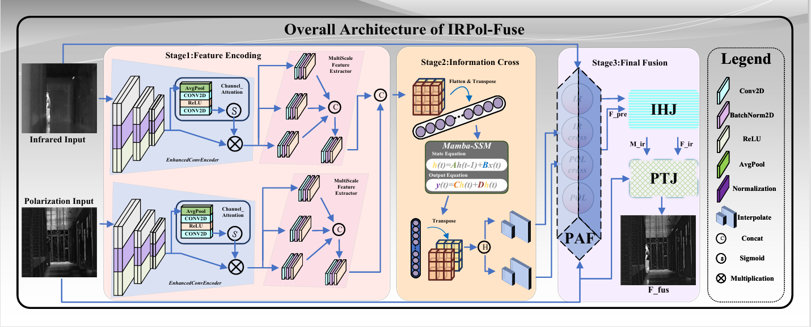
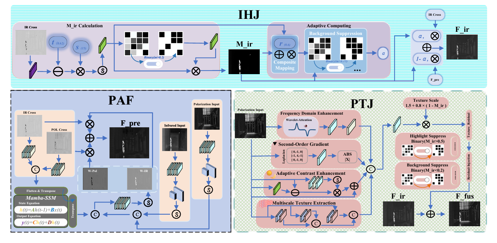
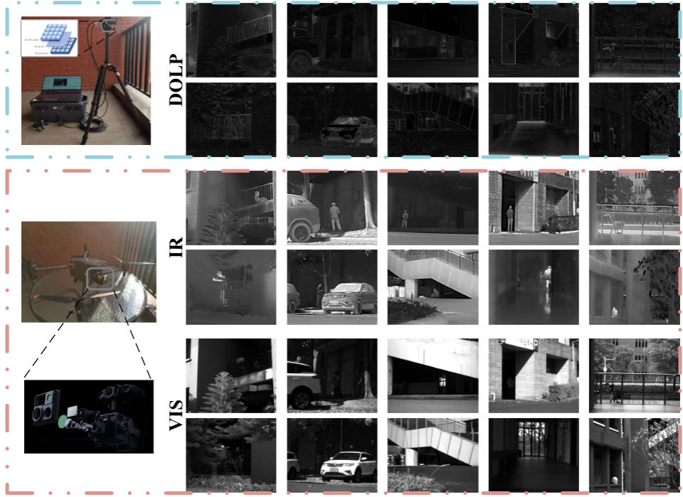
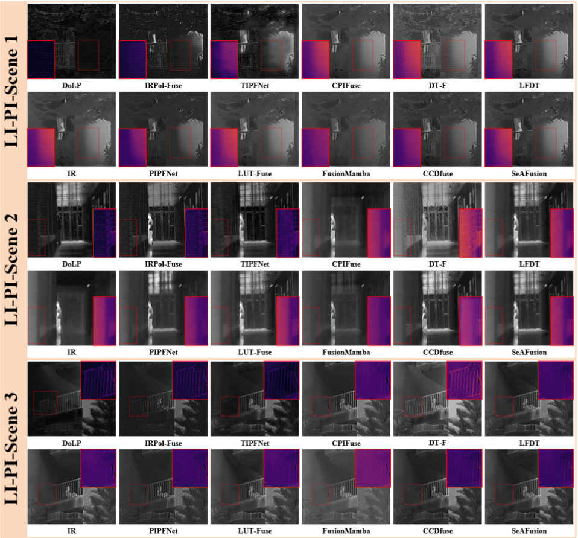
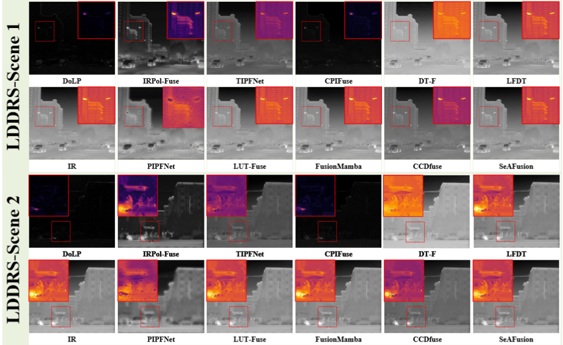
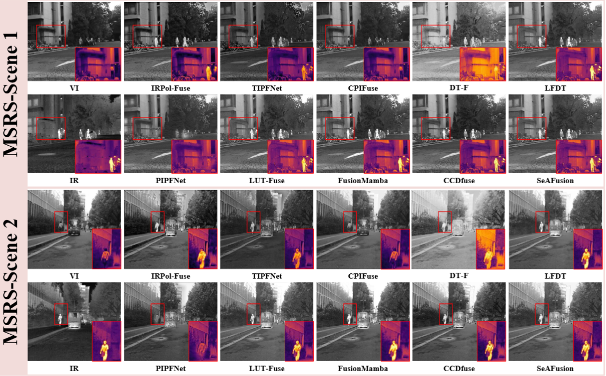
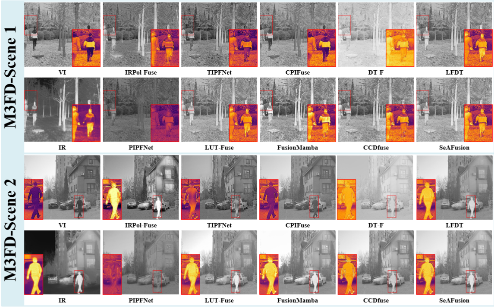

# IRPol-Fuse：Energy–Structure Coordination for Infrared Polarization Fusion under Low Visibility


<p align="center">
  <b>Zhuangfan Huang</b>,
  Chusheng Fang,
  Xiaosong Li,
  Yang Liu,
  Xiaoqi Cheng,
  Haishu Tan
</p>

<p align="center">
  <a href="YOUR_ARXIV_LINK">
    
  </a>
  <a href="https://pan.baidu.com/s/13ObQ8VmiruiBUz1A_9YMcA?pwd=a79c">
    
  </a>
  <a href="https://pan.baidu.com/s/1xmbyjUPe4AkXTUbiitNIHw?pwd=mn32">
    
  </a>
</p>

<p align="center">
  <a href="YOUR_ARXIV_LINK">Paper</a> |
  <a href="#li-pi-dataset">Dataset</a> |
  <a href="#experimental-results">Results</a> |
  <a href="#pretrained-model">Model</a> |
  <a href="#installation">Installation</a> |
  <a href="#training">Training</a> |
  <a href="#testing">Testing</a>
</p>

---

## News

- **[2026.xx.xx]** IRPol-Fuse is available on arXiv.
- **[2026.xx.xx]** The source code and pretrained model are released.
- **[2026.xx.xx]** The LI-PI dataset is released.

---

# Overview

Robust perception under low-visibility conditions requires fused imagery that jointly preserves infrared thermal saliency and polarization-derived structural details. However, existing infrared-polarization image fusion methods may overemphasize dominant infrared responses, causing weak yet informative polarization textures in dark or visually concealed regions to be suppressed.

We propose **IRPol-Fuse**, an energy-structure coordinated infrared-polarization image fusion framework for challenging low-visibility scenarios.

IRPol-Fuse contains three key modules:

- **Polarization Attention Fusion (PAF)** for adaptive infrared-polarization information allocation.
- **Infrared Highlight Injector (IHJ)** for highlight-guided infrared preservation.
- **Polarization Texture Injector (PTJ)** for polarization texture restoration and fine-detail recovery.

We further construct **LI-PI**, a dedicated infrared-polarization dataset for low-visibility and visually concealed scenarios.

---

# Network Architecture

<p align="center">
  
</p>

<p align="center">
  <b>Overall architecture of IRPol-Fuse.</b>
</p>

IRPol-Fuse follows a three-stage fusion pipeline:

1. **Modality-specific feature encoding**
2. **Cross-modal long-range interaction**
3. **Sequential energy-structure coordination through PAF, IHJ, and PTJ**

After cross-modal interaction, PAF first generates a preliminary fused representation. IHJ subsequently preserves thermally salient infrared responses through adaptive infrared reinjection. Finally, PTJ restores polarization-derived structural details to obtain the final fused image.

---

# Core Modules

<p align="center">
  
</p>

<p align="center">
  <b>Detailed structures of PAF, IHJ, and PTJ.</b>
</p>

## Polarization Attention Fusion (PAF)

PAF adaptively allocates infrared thermal responses and polarization structural information according to cross-modal feature responses, providing the preliminary fused representation for subsequent refinement.

## Infrared Highlight Injector (IHJ)

IHJ explicitly preserves thermally salient infrared responses through an infrared-response-guided adaptive reinjection strategy while avoiding excessive thermal information transfer into weak-response background regions.

## Polarization Texture Injector (PTJ)

PTJ restores polarization-derived structural information using four complementary branches:

- Frequency Domain Enhancement
- Second-Order Gradient
- Adaptive Contrast Enhancement
- Multiscale Texture Extraction

The generated polarization texture residual is further modulated according to infrared responses to balance thermal target preservation and structural detail recovery.

---

# LI-PI Dataset

We construct **LI-PI**, a dedicated infrared-polarization dataset for challenging low-visibility and visually concealed scenarios.

LI-PI contains **110 strictly aligned infrared-polarization image pairs**, divided into:

| Split | Number of image pairs |
|---|---:|
| Training | 90 |
| Validation | 10 |
| Testing | 10 |
| **Total** | **110** |

The validation set is used for model selection and hyperparameter analysis, while the independent test set is used only for final evaluation.

LI-PI covers representative challenging conditions including:

- Parking garages
- Balconies
- Forests
- Corridors
- Local glare interference
- Weak background structures
- Visually concealed targets
- Low-visibility environments

## LI-PI Dataset Illustration

<p align="center">
  
</p>

<p align="center">
  <b>Illustration of the LI-PI dataset and representative low-visibility scenes.</b>
</p>

## Dataset Download

The LI-PI dataset can be downloaded from Baidu Netdisk.

| Resource | Download | Password |
|---|---|---|
| LI-PI Dataset | [Baidu Netdisk](https://pan.baidu.com/s/13ObQ8VmiruiBUz1A_9YMcA?pwd=a79c) | `a79c` |

The released dataset contains the training, validation, and independent testing subsets used in our experiments.

---

# Installation

Please install the required environment according to `requirements.txt`.

```bash
# TODO: Environment installation commands
```

The detailed environment configuration will be added here.

---

# Dataset Preparation

After downloading LI-PI, please place the dataset in the corresponding directory and modify the paths in the training/testing commands according to your local environment.

An example repository structure is:

```text
IRPol-Fuse/
├── README.md
├── requirements.txt
│
├── fig/
│   ├── fig1.png
│   ├── fig2.png
│   ├── fig3.png
│   ├── fig4.png
│   ├── fig5.png
│   ├── fig8.png
│   └── fig9.png
│
├── data/
│   └── LI-PI/
│
├── checkpoints_retrain/
│
├── train.py
├── test.py
│
└── ...
```

---

# Training

Before training, please modify `--data_root` and `--test_root` according to your local dataset paths.

```bash
CUDA_VISIBLE_DEVICES=2 python train.py \
    --data_root YOUR_TRAIN_DATA_PATH \
    --test_root YOUR_TEST_DATA_PATH \
    --save_dir checkpoints_retrain
```

The LI-PI dataset split used in the paper is:

```text
Training   : 90 image pairs
Validation : 10 image pairs
Testing    : 10 image pairs
```

The final loss configuration is:

```text
lambda_fusion = 1.0
lambda_ir     = 2.0
lambda_pol    = 2.5
```

The final IHJ configuration is:

```text
Injection ratio : 0.60
Sharpness       : 15
Threshold       : 0.62
```

---

# Testing

Download the pretrained checkpoint and modify the dataset and output paths according to your local environment.

```bash
python test.py \
    --ckpt ./epoch_11.pth \
    --data_root YOUR_TEST_DATA_PATH \
    --out_dir YOUR_OUTPUT_PATH \
    --device cuda
```

The fused images will be saved to the directory specified by `--out_dir`.

---

# Pretrained Model

The pretrained IRPol-Fuse model can be downloaded from Baidu Netdisk.

| Model | Training Dataset | Download | Password |
|---|---|---|---|
| IRPol-Fuse | LI-PI | [Baidu Netdisk](https://pan.baidu.com/s/1xmbyjUPe4AkXTUbiitNIHw?pwd=mn32) | `mn32` |

---

# Experimental Results

## Quantitative Comparison on LI-PI

| Method | QP ↑ | QS ↑ | QCB ↑ | QCV ↓ | QAB/F ↑ | MS-SSIM ↑ |
|---|---:|---:|---:|---:|---:|---:|
| **IRPol-Fuse** | **0.355** | **0.805** | **0.532** | **171.583** | **0.628** | **0.930** |
| TIPFNet | 0.346 | 0.770 | 0.487 | 199.669 | 0.624 | 0.929 |
| CPIFuse | 0.176 | 0.475 | 0.218 | 216.936 | 0.248 | 0.744 |
| LFDT | 0.235 | 0.472 | 0.257 | 218.473 | 0.335 | 0.721 |
| LUT-Fuse | 0.149 | 0.367 | 0.240 | 211.443 | 0.266 | 0.624 |
| PIPFNet | 0.137 | 0.368 | 0.225 | 229.187 | 0.144 | 0.592 |
| DT-F | 0.354 | 0.501 | 0.332 | 322.379 | 0.624 | 0.928 |
| FusionMamba | 0.113 | 0.436 | 0.170 | 263.748 | 0.208 | 0.746 |
| CDDFuse | 0.295 | 0.555 | 0.262 | 186.820 | 0.354 | 0.825 |
| SeAFusion | 0.178 | 0.569 | 0.283 | 240.403 | 0.450 | 0.841 |

IRPol-Fuse achieves the best performance across all six global fusion metrics on the LI-PI test set, demonstrating effective coordination between infrared thermal saliency and polarization-derived structural information.

---

## Qualitative Comparison on LI-PI

<p align="center">
  
</p>

<p align="center">
  <b>Qualitative comparison on the LI-PI test set.</b>
</p>

IRPol-Fuse preserves salient infrared targets while maintaining clearer polarization-derived textures and structural details under challenging low-visibility conditions.

---

# Region-Aware Evaluation

To provide an evaluation more directly related to thermal target preservation and polarization texture recovery, we further introduce an infrared-response-guided region-aware evaluation protocol.

| Method | IR ROI Corr ↑ | IR CNR ↑ | Pol Grad Corr ↑ | Pol Grad MAE ↓ |
|---|---:|---:|---:|---:|
| **IRPol-Fuse** | 0.886 | 3.306 | **0.959** | **0.012** |
| TIPFNet | 0.487 | 0.285 | 0.197 | 0.063 |
| CPIFuse | 0.848 | **3.544** | 0.800 | 0.025 |
| LFDT | **0.995** | 3.192 | 0.779 | 0.033 |
| LUT-Fuse | 0.964 | 3.065 | 0.788 | 0.034 |
| PIPFNet | 0.501 | 2.823 | 0.441 | 0.041 |
| DT-F | 0.534 | 2.207 | 0.859 | 0.028 |
| FusionMamba | 0.880 | 2.443 | 0.895 | 0.024 |
| CDDFuse | 0.941 | 2.257 | 0.894 | 0.029 |
| SeAFusion | 0.528 | 3.267 | 0.857 | 0.021 |

IRPol-Fuse achieves the best results on both polarization texture metrics, with a **Pol Grad Corr of 0.959** and a **Pol Grad MAE of 0.012**.

These results demonstrate that IRPol-Fuse can effectively recover polarization-derived structural information while maintaining competitive infrared target preservation.

---

# Generalization on LDDRS

To evaluate generalization under conventional infrared-polarization imaging conditions, IRPol-Fuse is directly evaluated on the external **LDDRS** dataset.

## Quantitative Comparison

| Method | QP ↑ | QS ↑ | QCB ↑ | QCV ↓ | QAB/F ↑ | MS-SSIM ↑ |
|---|---:|---:|---:|---:|---:|---:|
| **IRPol-Fuse** | 0.484 | **0.728** | 0.499 | 393.908 | **0.534** | 0.927 |
| TIPFNet | 0.329 | 0.579 | 0.320 | 982.441 | 0.430 | 0.924 |
| CPIFuse | **0.509** | 0.676 | **0.507** | 1961.014 | 0.442 | 0.907 |
| LFDT | 0.374 | 0.468 | 0.224 | 79.728 | 0.408 | 0.809 |
| LUT-Fuse | 0.208 | 0.438 | 0.222 | 94.077 | 0.356 | 0.761 |
| PIPFNet | 0.094 | 0.311 | 0.335 | 1920.085 | 0.167 | 0.300 |
| DT-F | 0.343 | 0.418 | 0.256 | 346.184 | 0.397 | **0.929** |
| FusionMamba | 0.123 | 0.485 | 0.250 | **75.322** | 0.227 | 0.880 |
| CDDFuse | 0.287 | 0.505 | 0.223 | 150.082 | 0.332 | 0.887 |
| SeAFusion | 0.268 | 0.510 | 0.251 | 77.722 | 0.374 | 0.895 |

IRPol-Fuse achieves the best QS and QAB/F scores and remains competitive across the remaining metrics, demonstrating promising generalization to an external infrared-polarization dataset.

---

## Qualitative Comparison on LDDRS

<p align="center">
  
</p>

<p align="center">
  <b>Qualitative comparison on the external LDDRS dataset.</b>
</p>

The results indicate that IRPol-Fuse maintains a favorable balance between infrared thermal responses and polarization-derived structural details under external infrared-polarization imaging conditions.

---

# Cross-Modality Generalization

To further examine the transferability of the proposed energy-structure coordination strategy, IRPol-Fuse is additionally evaluated on two infrared-visible image fusion datasets:

- **MSRS**
- **M3FD**

These experiments provide complementary evidence regarding the generalization ability of the proposed framework beyond infrared-polarization fusion.

## Qualitative Comparison on MSRS

<p align="center">
  
</p>

<p align="center">
  <b>Qualitative comparison on the MSRS dataset.</b>
</p>

---

## Qualitative Comparison on M3FD

<p align="center">
  
</p>

<p align="center">
  <b>Qualitative comparison on the M3FD dataset.</b>
</p>

Detailed quantitative results are reported in the paper.

---

# Ablation Study

The contributions of the proposed cross-modal interaction, IHJ, and PTJ modules are evaluated on the LI-PI test set.

| Method | QP ↑ | QS ↑ | QCB ↑ | QCV ↓ | QAB/F ↑ | MS-SSIM ↑ |
|---|---:|---:|---:|---:|---:|---:|
| **IRPol-Fuse** | **0.355** | **0.805** | **0.532** | **171.583** | **0.628** | **0.930** |
| w/o IHJ | 0.332 | 0.756 | 0.453 | 188.761 | 0.580 | 0.911 |
| w/o PTJ | 0.345 | 0.804 | 0.525 | 179.074 | 0.620 | 0.928 |
| w/o Cross + IHJ | 0.350 | 0.766 | 0.468 | 184.127 | 0.610 | 0.926 |
| w/o Cross + PTJ | 0.353 | 0.805 | 0.523 | 189.215 | 0.616 | 0.926 |
| w/o IHJ + PTJ | 0.343 | 0.764 | 0.472 | 198.403 | 0.604 | 0.920 |
| Baseline | 0.346 | 0.762 | 0.457 | 188.551 | 0.591 | 0.917 |

The complete model consistently provides the most balanced performance, validating the complementary roles of infrared preservation and polarization texture restoration.

---

# Hyperparameter Sensitivity

The final configuration adopted in IRPol-Fuse is:

```text
lambda_fusion = 1.0
lambda_ir     = 2.0
lambda_pol    = 2.5

ihj_ratio     = 0.60
ihj_sharpness = 15
ihj_thresh    = 0.62
```

Detailed sensitivity analyses are provided in the paper.

---

# Computational Complexity

| Method | FLOPs (G) ↓ | Parameters (M) ↓ | Time (ms) ↓ |
|---|---:|---:|---:|
| IRPol-Fuse | 2608.007 | 4.553 | 515.279 |
| TIPFNet | 1569.841 | 4.151 | 768.695 |
| CPIFuse | 275.347 | 0.874 | 174.944 |
| LFDT | 3067.163 | 17.898 | 953.243 |
| LUT-Fuse | 13.200 | 0.008 | 13.997 |
| PIPFNet | 121.133 | 0.034 | 455.377 |
| DT-F | 1173.224 | 0.834 | 1776.724 |
| FusionMamba | 688.729 | 85.489 | 306.040 |
| CDDFuse | 2983.823 | 1.186 | 1243.021 |
| SeAFusion | 277.797 | 0.167 | 74.086 |

IRPol-Fuse is designed as a performance-oriented energy-structure coordination framework rather than a lightweight architecture.

---

# Model Zoo

| Model | Training Dataset | Download | Password |
|---|---|---|---|
| IRPol-Fuse | LI-PI | [Baidu Netdisk](https://pan.baidu.com/s/1xmbyjUPe4AkXTUbiitNIHw?pwd=mn32) | `mn32` |

---

# Download

## LI-PI Dataset

- **Baidu Netdisk:** [Download LI-PI](https://pan.baidu.com/s/13ObQ8VmiruiBUz1A_9YMcA?pwd=a79c)
- **Password:** `a79c`

## Pretrained Model

- **Baidu Netdisk:** [Download Pretrained Model](https://pan.baidu.com/s/1xmbyjUPe4AkXTUbiitNIHw?pwd=mn32)
- **Password:** `mn32`

---

# Repository Structure

```text
IRPol-Fuse/
├── README.md
├── requirements.txt
│
├── fig/
│   ├── fig1.png    # LI-PI qualitative comparison
│   ├── fig2.png    # LDDRS qualitative comparison
│   ├── fig3.png    # MSRS qualitative comparison
│   ├── fig4.png    # M3FD qualitative comparison
│   ├── fig5.png    # LI-PI dataset illustration
│   ├── fig8.png    # overall architecture
│   └── fig9.png    # PAF / IHJ / PTJ modules
│
├── data/
│   └── LI-PI/
│
├── checkpoints_retrain/
│
├── train.py
├── test.py
│
└── ...
```

---

# Citation

If you find **IRPol-Fuse** or the **LI-PI dataset** useful in your research, please cite our paper:

```bibtex
@article{huang2026irpol,
  title   = {IRPol-Fuse: Energy--Structure Coordination for Infrared Polarization Fusion under Low Visibility},
  author  = {Huang, Zhuangfan and Fang, Chusheng and Li, Xiaosong and Liu, Yang and Cheng, Xiaoqi and Tan, Haishu},
  journal = {arXiv preprint arXiv:XXXX.XXXXX},
  year    = {2026}
}
```

The BibTeX entry will be updated after the final journal publication.

---

# Acknowledgements

We sincerely thank the authors of the public datasets and comparison methods used in this work, including **TIPFNet, CPIFuse, DT-F, PIPFNet, LFDT-Fusion, FusionMamba, CDDFuse, LUT-Fuse, and SeAFusion**.

---

# Contact

For questions regarding the paper, source code, pretrained model, or LI-PI dataset, please open an issue in this repository.

---

# License

The code and LI-PI dataset license will be provided upon release.
